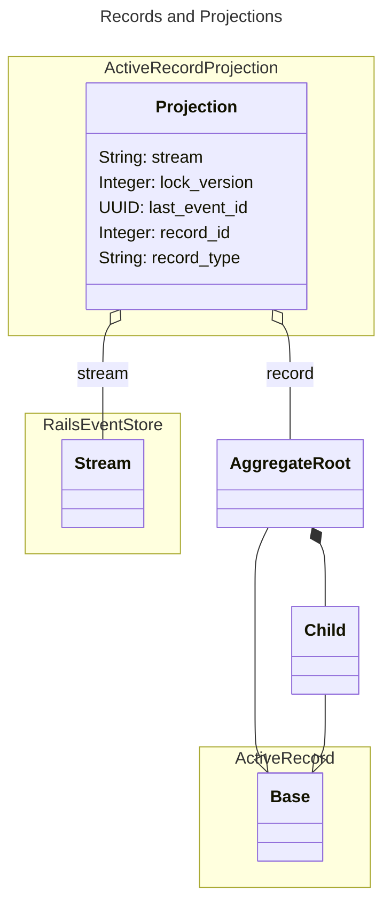

# Active Record Projection

Persistent [Rails Event Store](https://railseventstore.org/) projections built on [Active Record](https://guides.rubyonrails.org/active_record_basics.html) models.

Built on the Rails Event Store [Aggregate Root](https://railseventstore.org/docs/core-concepts/event-sourcing).

How it works:
- a projection is built from a [stream](https://railseventstore.org/docs/core-concepts/link) of events
  - a projection only has a single stream but a stream can be the source of multiple projections
- each projection has a [polymorphic](https://guides.rubyonrails.org/association_basics.html#polymorphic-associations) association to a record
  - this record is your Active Record model that functions as an [aggregate root](https://www.baeldung.com/cs/aggregate-root-ddd#aggregates-and-aggregate-roots)
  - it can update its own state and the state of its children by projecting events
- an async event handler is automatically [subscribed](https://railseventstore.org/docs/core-concepts/subscribe) to all events that you project using the `on` method
  - when an event of each type occurs, the projections subscribed to all streams in which that event is linked are notified
  - unseen events are then read, applied and the record is saved
- [optimistic locking](https://api.rubyonrails.org/classes/ActiveRecord/Locking/Optimistic.html) is used to control concurrent updates to the projection/record



## Installation
  Not yet published as a gem, 
```ruby
gem 'activerecord-projection', git: 'https://github.com/brentsnook/activerecord-projection'
```

Create a `active_record_projection_projections` table in your database:
```bash
bundle exec rails generate activerecord-projection:install
```

## Example
To make your Active Record model a projection of an aggregate root:
- include `ActiveRecordProjection`
- define a `get_stream` method to allow a stream to be determined from the model data
- define how to project each event using the [Aggregate Root syntax](https://railseventstore.org/docs/core-concepts/event-sourcing#define-aggregate-logic) (define `on` methods)

```ruby
class Order < ApplicationRecord
  include ActiveRecordProjection

  on OrderSubmitted.event_type do |event|
    self.state = :submitted
    self.delivery_date = event.data.fetch(:delivery_date)
  end

  on OrderExpired.event_type do |_event|
    self.state = :expired
  end

  private

  def get_stream
    "orders$#{uuid}"
  end
end
```

You need to add a `on` method for each event type in a stream, even if you don't need it in order to project.